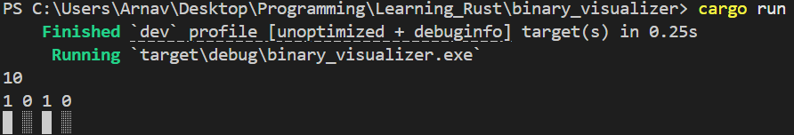

# Learning Rust

## 1. Binary Visualizer

### How to run?

- Prerequisite: Rust is installed in your machine.
- Go to `binary_visualizer` folder.
- Open `Terminal` and run the command: `cargo run`.
- Input an integer and visualize the binary number.

